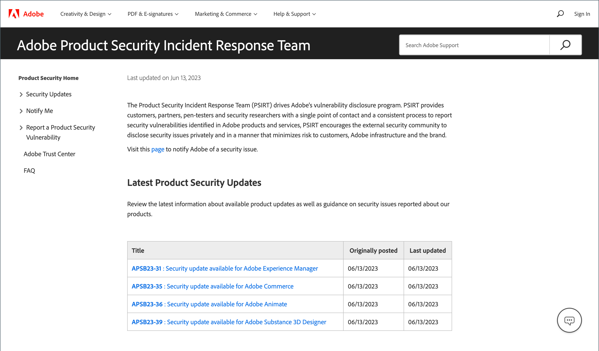

# Sécurité

Il existe plusieurs façons de sécuriser votre magasin et de maintenir votre sécurité des données :

- Configuration de l&#39;[authentification à deux facteurs](security-two-factor-authentication.md)
- Implémentez [CAPTCHA](security-captcha.md) ou [reCAPTCHA](security-google-recaptcha.md)
- Configurez une [analyse de sécurité](security-scan.md) pour chaque domaine de votre installation Adobe Commerce ou Magento Open Source.

>[!NOTE]
>
>Les magasins qui ont activé l’authentification [!DNL Adobe Identity Management Services] (IMS) ont natif Adobe Commerce et Magento Open Source 2FA désactivé. Les utilisateurs administrateurs connectés à leur instance Commerce avec leurs informations d’identification d’Adobe n’ont pas besoin de se réauthentifier pour de nombreuses tâches d’administration. L’authentification est gérée par Adobe IMS lorsque l’utilisateur administrateur se connecte à sa session en cours. Voir [[!DNL Adobe Identity Management Service] (IMS) Présentation de l’intégration ](../getting-started/adobe-ims-integration-overview.md).

Visitez le [Centre de sécurité](https://helpx.adobe.com/security.html){:target=&quot;_blank&quot;} pour obtenir les dernières informations sur les vulnérabilités potentielles, enregistrez-vous pour recevoir des notifications de sécurité Adobe et accédez au Centre de gestion de l’Adobe.

{width="700" zoomable="yes"}

Pour plus d’informations sur les bonnes pratiques en matière de sécurité, voir [Sécuriser votre site et votre infrastructure Commerce](https://experienceleague.adobe.com/docs/commerce-operations/implementation-playbook/best-practices/launch/security-best-practices.html) dans le _manuel d’implémentation_.

## Plan d’action de sécurité

Si vous pensez que votre site Adobe Commerce ou Magento Open Source est compromis, suivez ce plan d’action sans délai.

1. **Diagnostic** : exécutez une analyse pour établir l’état de sécurité de votre boutique Commerce. Commerce [Security Scan](security-scan.md) est un service gratuit proposé par Adobe qui vous permet de surveiller vos sites Commerce à la recherche de risques de sécurité et de logiciels malveillants connus, et de recevoir des notifications de sécurité.

1. **Clean** : embauche un [consultant qualifié](https://solutionpartners.adobe.com/s/directory/?partner_type=1) ou service en ligne pour nettoyer votre site de tout code malveillant. Certains membres de la communauté Commerce recommandent [[!DNL Sucuri Website Malware Removal]](https://sucuri.net/website-antivirus/malware-removal). Recherchez le code exécutable restant dans le dossier `/media`. Supprimez tous les utilisateurs administrateurs inconnus et réinitialisez tous les mots de passe administrateur.

1. **Protect** : maintenez votre installation Commerce à jour avec la version la plus récente. Si vous utilisez une ancienne version, appliquez tous les correctifs de sécurité dès qu&#39;ils deviennent disponibles. Passez en revue et suivez les [bonnes pratiques de sécurité Commerce](https://www.adobe.com/content/dam/cc/en/trust-center/ungated/whitepapers/experience-cloud/adobe-commerce-best-practices-guide.pdf). Abonnez-vous à [Alertes de sécurité Commerce](https://www.adobe.com/subscription/adbeSecurityNotifications.html).

1. **Rapport** : si vous pensez avoir trouvé une vulnérabilité spécifique dans Commerce, [ouvrez un problème avec Adobe](https://hackerone.com/adobe?type=team) et incluez des détails techniques.

1. **Mise à niveau** : pour bénéficier d’une plus grande tranquillité d’esprit grâce à la prise en charge de 24/7, planifiez votre mise à niveau vers [Adobe Commerce sur notre architecture cloud](https://business.adobe.com/products/magento/cloud-delivery.html) maintenant.
