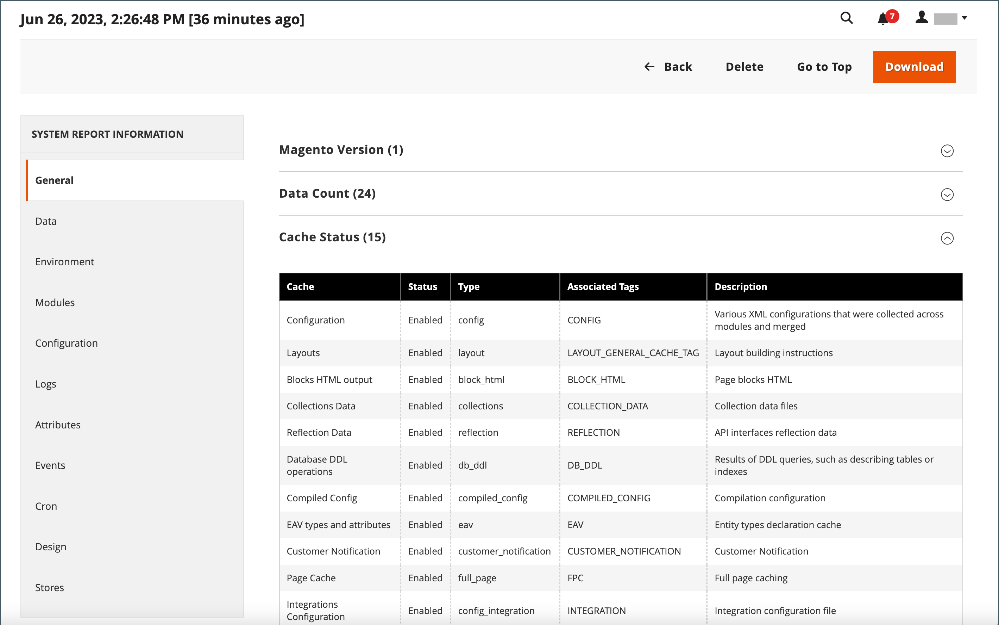

# Outils d’assistance

{{ee-feature}}

Les outils d’assistance sont conçus pour identifier les problèmes connus de votre système. Ils peuvent être utilisés comme ressource au cours des processus de développement et d’optimisation, et comme outil de diagnostic pour aider notre équipe d’assistance à identifier et résoudre les problèmes.

## Collecteur de données

Le collecteur de données rassemble les informations sur votre système dont notre équipe d’assistance a besoin pour résoudre les problèmes liés à votre installation d’Adobe Commerce. La sauvegarde créée prend plusieurs minutes et comprend à la fois un vidage de code et de base de données. Les données peuvent être exportées dans un fichier CSV ou XML Excel.

{width="600" zoomable="yes"}

### Exécution du collecteur de données

1. Sur la barre latérale _Admin_, accédez à **[!UICONTROL System]** > _[!UICONTROL Support]_>**[!UICONTROL Data Collector]**.

1. Dans le coin supérieur droit, cliquez sur **[!UICONTROL New Backup]**.

   La génération de la sauvegarde prend quelques minutes. Vous pouvez surveiller les résultats du traitement en cliquant sur **[!UICONTROL Refresh Status]**. Une fois la sauvegarde terminée, elle s’affiche dans la grille _[!UICONTROL Data Collector]_.

1. Pour afficher un journal avec les détails de sauvegarde, procédez comme suit :

   - Dans la colonne _[!UICONTROL Action]_, sélectionnez **[!UICONTROL Show Log]**.

   - Cliquez sur **[!UICONTROL Back]** pour revenir à la grille.

   {width="600" zoomable="yes"}

### Exporter les données de sauvegarde

1. Dans la première colonne, cochez la case de la sauvegarde à exporter.

1. Utilisez le menu **[!UICONTROL Export]** pour choisir le format des données d&#39;export.

   {width="600" zoomable="yes"}

1. Accédez au fichier à partir de l’emplacement de téléchargement du navigateur Web et **[!UICONTROL Save]**.

### Téléchargement des données de sauvegarde

Une fois la sauvegarde générée, vous pouvez télécharger la copie du code et des données de la base de données.

1. Recherchez l’entité de sauvegarde nécessaire dans la grille.

1. Assurez-vous qu’il a l’état `Complete`.

1. Cliquez sur le nom de l’entité dans les colonnes _[!UICONTROL Code Dump]_ou_[!UICONTROL DB Dump]_ .

Le processus de téléchargement doit démarrer automatiquement.

## Suppression des données de sauvegarde

1. Sur la barre latérale _Admin_, accédez à **[!UICONTROL System]** > _[!UICONTROL Support]_>**[!UICONTROL Data Collector]**.

1. Recherchez et sélectionnez les données de sauvegarde à supprimer.

1. Dans la colonne _[!UICONTROL Action]_, cliquez sur **[!UICONTROL Delete]**.

1. Pour confirmer l’action, cliquez sur **[!UICONTROL OK]**.

## Rapports système

L’outil de reporting du système vous permet de prendre des instantanés complets, ou partiels, périodiques du système et de les enregistrer à des fins de référence ultérieure. Vous pouvez comparer les paramètres de performances avant et après les cycles de développement du code ou les modifications apportées aux paramètres du serveur. L’outil de création de rapports du système peut réduire considérablement le temps passé à préparer et à envoyer les informations requises par l’assistance pour lancer une enquête.

Dans la grille Rapports système, vous pouvez afficher et télécharger des rapports existants, supprimer des rapports et créer des rapports.

### Accès aux rapports système

Sur la barre latérale _Admin_, accédez à **[!UICONTROL System]** > _[!UICONTROL Support]_>**[!UICONTROL System Report]**.

{width="600" zoomable="yes"}

### Générer un rapport

1. Cliquez sur **[!UICONTROL New Report]**.

1. Dans la liste **[!UICONTROL Groups]**, sélectionnez chaque ensemble d’informations à inclure dans le rapport. Par défaut, tous les groupes sont sélectionnés.

   {width="600" zoomable="yes"}

1. Dans le coin supérieur droit, cliquez sur **[!UICONTROL Create]**.

   La génération du rapport peut prendre quelques minutes, selon le nombre de types de rapports sélectionnés. Lorsque le rapport est prêt, il s’affiche en haut de la grille avec la date et l’heure générées.

### Affichage des informations sur le module

Vous trouverez des informations utiles sur les modules installés.

**_Pour afficher les informations de rapport pour chaque module installé :_**

1. Sur la barre latérale _Admin_, accédez à **[!UICONTROL System]** > _[!UICONTROL Support]_>**[!UICONTROL System Report]**.
1. Cliquez sur **[!UICONTROL New Report]**.
1. Sélectionnez `Modules` dans la liste **[!UICONTROL Groups]**.
1. Cliquez sur **[!UICONTROL Create]**.
1. Une fois le rapport généré, cliquez sur **[!UICONTROL Select]**, puis sur **[!UICONTROL View]** pour afficher toutes les versions de module.
1. Cliquez sur **[!UICONTROL Download]** pour télécharger le rapport.

### Gestion des rapports système

Dans la colonne **[!UICONTROL Action]** de la grille, sélectionnez l’une des options suivantes :

- `View` - Utilisez cette fonction pour afficher les détails du rapport.
- `Delete` - Utilisez cette fonction pour supprimer le rapport généré de la liste.
- `Download` - Utilisez cette fonction pour enregistrer le rapport en tant que fichier d’HTML.

### Affichage des détails du rapport système

1. Pour le rapport dont vous avez besoin, sélectionnez **[!UICONTROL View]** dans la colonne _[!UICONTROL Actions]_.

1. Dans le panneau de gauche, développez  de chaque section du rapport pour afficher les détails.

   {width="600" zoomable="yes"}

### Rapports système disponibles

| Groupe de rapports | Informations incluses |
| ------------ | -------------------- |
| [!UICONTROL General] | Version d’Adobe Commerce Nombre de données État du cache État de l’index |
| [!UICONTROL Environment] | Informations sur l’environnement  État de MySQL |
| [!UICONTROL Data] | Dupliquer Les Catégories Par Clé D&#39;URL Dupliquer Les Produits Par Clé D&#39;URL Dupliquer Les Produits Par SKU Dupliquer Les Commandes Par Id D&#39;Incrémentation Dupliquer Les Utilisateurs Par Email Données De Catégories Corrompues |
| [!UICONTROL Modules] | Liste des modules personnalisés Liste des modules désactivés Liste de tous les modules |
| [!UICONTROL Configuration] | Configuration Données provenant de `app/etc/env.php` méthodes de livraison méthodes de paiement matrice des fonctionnalités de paiement |
| [!UICONTROL Logs] | Fichiers journaux Principaux messages système Principaux messages système du jour Principaux messages de débogage Principaux messages de débogage du jour Principaux messages d’exception Principaux messages d’exception d’aujourd’hui |
| [!UICONTROL Attributes] | Attributs EAV Définis Par L’Utilisateur Nouveaux Attributs EAV Types D’Entité Tous Les Attributs EAV Attributs EAV De Catégorie Attributs EAV De Produit Attributs Customer EAV Attribut Customer Address EAV Attribut RMA Item EAV Attributs |
| [!UICONTROL Events] | Événements globaux personnalisés Événements d’administration personnalisés Événements front-end personnalisés Événements Doc personnalisés Événements Crontab personnalisés Événements SOAP personnalisés Événements globaux principaux Événements principaux d’administration Événements principaux front-end Événements principaux Doc Événements principaux Crontab Événements principaux }Événements REST événements principaux Événements principaux}}Événements principaux1}Événements principaux1}Événements principaux1}Événements principaux1}Événements de REST Événements principauxÉvénements principaux2}Événements principaux1}Événements principaux1}Événements principaux2}Évén3}Tous les événements globaux Tous les événements d’administration Tous les événements frontend Tous les événements Doc Tous les événements REST Tous les événements SOAP Tous les événements Crontab |
| [!UICONTROL Cron] | Planifications cron par code d’état Planifications cron par code de tâche Erreurs dans la file d’attente des plannings cron Liste des plannings cron Tâches Cron globales personnalisées Tâches Cron configurables personnalisées Tâches Cron principales Tâches Cron configurables Toutes les tâches Cron globales  |
| [!UICONTROL Design] | Adminhtml Liste de thèmes Liste de thèmes front |
| [!UICONTROL Stores] | Arborescence De Sites Web Liste De Sites Web Liste De Magasins Liste De Vues De Magasin |
| Connecteur OMS  _(visible avec l’intégration OMS){1_ | Version du connecteur Surveillance du connecteur Résultats du traitement des messages |

{style="table-layout:auto"}
