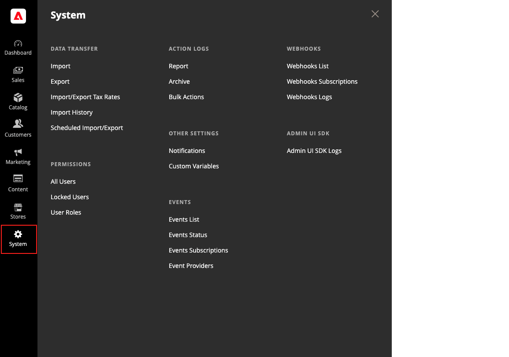

# [!UICONTROL System] menu

Le menu [!UICONTROL System] comprend des outils permettant d’importer et d’exporter des données, de gérer les caches et les index système, de gérer les autorisations, les sauvegardes, les notifications système et les variables personnalisées.

>[!BEGINTABS]

>[!TAB Adobe Commerce]

[!BADGE PaaS uniquement]{type=Informative url="https://experienceleague.adobe.com/en/docs/commerce/user-guides/product-solutions" tooltip="S’applique uniquement aux projets Adobe Commerce on Cloud (infrastructure PaaS gérée par Adobe) et aux projets On-premise."}

{width="600" zoomable="yes"}

>[!TAB Adobe Commerce as a Cloud Service]

[!BADGE SaaS uniquement]{type=Positive url="https://experienceleague.adobe.com/en/docs/commerce/user-guides/product-solutions" tooltip="S’applique uniquement aux projets Adobe Commerce as a Cloud Service et Adobe Commerce Optimizer (infrastructure SaaS gérée par Adobe)."}

{width="600" zoomable="yes"}

>[!ENDTABS]

**_Pour afficher le menu [!UICONTROL System] :_**

Dans la barre latérale _Admin_, cliquez sur **[!UICONTROL System]**.

## [!UICONTROL Data Transfer]

Ces [ outils ](data-transfer.md) permettent de gérer plusieurs enregistrements en une seule opération. Vous pouvez importer de nouveaux articles, ainsi que mettre à jour, remplacer et supprimer des produits et des taux de taxe existants.

## [!UICONTROL Extensions]

[!BADGE PaaS uniquement]{type=Informative url="https://experienceleague.adobe.com/en/docs/commerce/user-guides/product-solutions" tooltip="S’applique uniquement aux projets Adobe Commerce on Cloud (infrastructure PaaS gérée par Adobe) et aux projets On-premise."}

Gérez les [intégrations tierces](integrations.md) et les extensions de votre boutique.

## [!UICONTROL Tools]

[!BADGE PaaS uniquement]{type=Informative url="https://experienceleague.adobe.com/en/docs/commerce/user-guides/product-solutions" tooltip="S’applique uniquement aux projets Adobe Commerce on Cloud (infrastructure PaaS gérée par Adobe) et aux projets On-premise."}

Utilisez cet ensemble d’outils pour gérer les ressources de votre système, notamment [cache](cache-management.md) et [index](index-management.md) la gestion, [sauvegardes](backups.md) et les paramètres d’installation.

## [!UICONTROL Support]

[!BADGE PaaS uniquement]{type=Informative url="https://experienceleague.adobe.com/en/docs/commerce/user-guides/product-solutions" tooltip="S’applique uniquement aux projets Adobe Commerce on Cloud (infrastructure PaaS gérée par Adobe) et aux projets On-premise."}

 (Adobe Commerce uniquement)

Les [ outils d’assistance ](support.md) peuvent être utilisés comme ressource au cours des processus de développement et d’optimisation, et comme outil de diagnostic pour aider notre équipe d’assistance à identifier et à résoudre les problèmes liés à votre système.

## [!UICONTROL Permissions]

Adobe Commerce et Magento Open Source utilisent des [rôles et autorisations](permissions.md) afin de créer différents niveaux d’accès pour les utilisateurs administrateurs. Ces outils permettent aux administrateurs d’accorder des autorisations sur la base du _besoin d’en connaître_ aux personnes qui travaillent sur votre site.

## [!UICONTROL Action Log]

 (Adobe Commerce uniquement)

Le [journal d’action](action-log.md) suit les activités des administrateurs qui travaillent dans votre magasin. Pour la plupart des événements, les informations disponibles incluent l’action, le nom de l’utilisateur, s’il s’agit d’un succès ou d’un échec, et l’identifiant de l’objet qui était la cible de l’action. L’archive des actions d’administration répertorie les fichiers journaux CSV stockés sur le serveur.

## [!UICONTROL Other Settings]

Gérez les [notifications](notifications.md) dans votre boîte de réception, créez des [variables personnalisées](variables-custom.md) et générez une nouvelle [clé de chiffrement](encryption-key.md).
