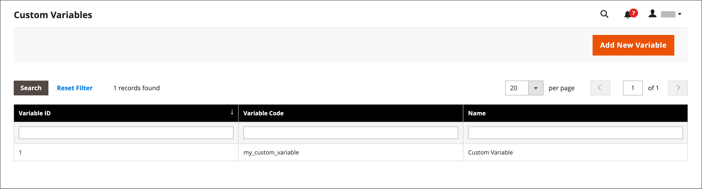

# Ajout de variables personnalisées

Pour répondre aux besoins spécifiques de votre entreprise, vous pouvez créer des variables personnalisées et les insérer dans les [pages](../content-design/pages.md), les [blocs](../content-design/blocks.md) et les [modèles d&#39;email](email-templates.md). La liste des variables autorisées qui s’affiche lorsque vous cliquez sur le bouton _Insérer la variable_ comprend à la fois des variables [prédéfinies](variables-predefined.md) et des variables personnalisées. La liste des variables disponibles pour un modèle d’email spécifique est déterminée par les données associées au modèle. Consultez la [référence de variable](variables-reference.md) pour obtenir la liste des modèles d’email fréquemment utilisés et de leurs variables associées.

{width="600" zoomable="yes"}

>[!NOTE]
>
>Seules les variables prédéfinies ou personnalisées autorisées peuvent être utilisées dans les modèles de courrier électronique et de newsletter.

## Étape 1 : création d’une variable personnalisée

1. Sur la barre latérale _Admin_, accédez à **[!UICONTROL System]** > _[!UICONTROL Other Settings]_>**[!UICONTROL Custom Variables]**.

1. Cliquez sur **[!UICONTROL Add New Variable]**.

1. Saisissez un identifiant pour **[!UICONTROL Variable Code]**, en utilisant tous les caractères minuscules sans espaces.

   Au besoin, vous pouvez utiliser un trait de soulignement ou un trait d’union pour représenter un espace. Par exemple : `my_custom_variable`

1. Saisissez un **[!UICONTROL Variable Name]**, utilisé pour la référence interne. Par exemple : `My Custom Variable`

1. Pour saisir la valeur associée à la variable, effectuez l’une des opérations suivantes :

   - Pour **[!UICONTROL Variable HTML Value]**, saisissez la valeur de variable formatée avec des balises d’HTML simples. Par exemple :

     `<b>This formatted content appears in place of the variable.</b>`

   - Pour **[!UICONTROL Variable Plain Value]**, saisissez la valeur de la variable en texte brut sans formatage. Par exemple :

     `This unformatted content appears in place of the variable.`

   >[!TIP]
   >
   >Si vous avez besoin d’espace supplémentaire, faites glisser le coin inférieur droit de la zone de texte.

   {width="600" zoomable="yes"}

1. Une fois l’opération terminée, cliquez sur **[!UICONTROL Save]**.

## Étape 2 : insertion de la variable personnalisée dans votre contenu

Utilisez [!DNL Page Builder] pour insérer une variable personnalisée.

1. Ouvrez la page, le bloc, la catégorie ou le produit sur lequel vous souhaitez ajouter la variable au contenu.

1. Développez la section  sur **[!UICONTROL Content]** .

1. Cliquez sur **[!UICONTROL Edit with Page Builder]**.

1. Dans le panneau de gauche, cliquez sur **[!UICONTROL Elements]** et effectuez l’une des opérations suivantes :

   - Cliquez dans une zone de texte existante où vous souhaitez insérer la variable.

   - Faites glisser un nouvel objet **[!UICONTROL Text]** sur la scène.

1. À l’extrémité droite de la barre d’outils de l’éditeur, cliquez sur (  ) pour insérer une variable.

   ![[!DNL Page Builder] étape et panneau](./assets/variable-custom-pagebuilder-stage.png){width="600" zoomable="yes"}

1. Dans la liste, sélectionnez la variable personnalisée à insérer, puis cliquez sur **[!UICONTROL Insert Variable]**.

   {width="600" zoomable="yes"}

   L’identifiant de variable apparaît comme espace réservé dans l’éditeur.

   ![[!DNL Page Builder] stage - espace réservé variable](./assets/pagebuilder-variable-inserted.png){width="600" zoomable="yes"}

1. Une fois l’opération terminée, cliquez sur **[!UICONTROL Save]**.
