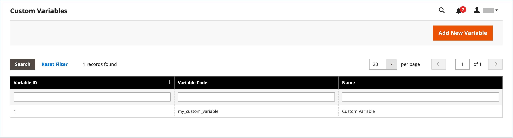
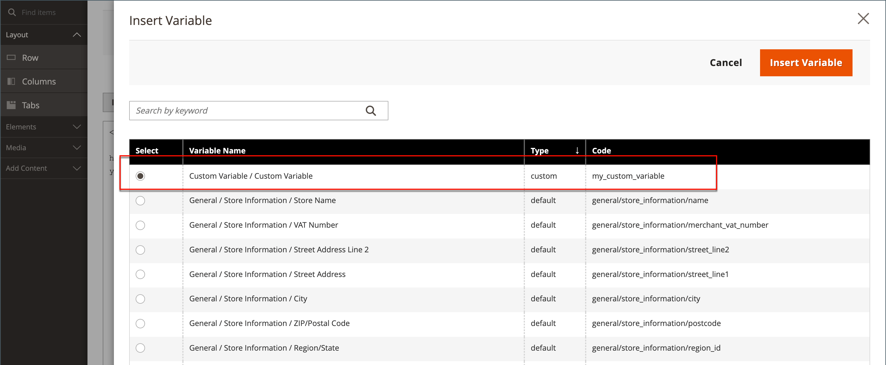

# Ajouter des variables personnalisées

Pour répondre aux besoins spécifiques de votre entreprise, vous pouvez créer des variables personnalisées et les insérer dans des [pages](../content-design/pages.md), [blocs](../content-design/blocks.md) et [modèles d’e-mail](email-templates.md). La liste des variables autorisées qui s’affiche lorsque vous cliquez sur le bouton _Insérer une variable_ comprend à la fois des variables [prédéfinies](variables-predefined.md) et des variables personnalisées. La liste des variables disponibles pour un modèle d’e-mail spécifique est déterminée par les données associées au modèle. Consultez la [Référence de variable](variables-reference.md) pour obtenir une liste des modèles d’e-mail fréquemment utilisés et des variables associées.

{width="600" zoomable="yes"}

>[!NOTE]
>
>Seules les variables prédéfinies ou personnalisées autorisées peuvent être utilisées dans les modèles d’e-mail et de newsletter.

## Étape 1 : créer une variable personnalisée

1. Dans la barre latérale _Admin_, accédez à **[!UICONTROL System]** > _[!UICONTROL Other Settings]_>**[!UICONTROL Custom Variables]**.

1. Cliquez sur **[!UICONTROL Add New Variable]**.

1. Saisissez un identifiant pour **[!UICONTROL Variable Code]**, en utilisant uniquement des caractères minuscules sans espaces.

   Si nécessaire, vous pouvez utiliser un caractère de soulignement ou un trait d’union pour représenter un espace. Par exemple : `my_custom_variable`

1. Saisissez un **[!UICONTROL Variable Name]**, qui est utilisé comme référence interne. Par exemple : `My Custom Variable`

1. Pour saisir la valeur associée à la variable, effectuez l’une des opérations suivantes :

   - Par **[!UICONTROL Variable HTML Value]**, saisissez la valeur de la variable au format avec de simples balises HTML. Par exemple :

     `<b>This formatted content appears in place of the variable.</b>`

   - Par **[!UICONTROL Variable Plain Value]**, saisissez la valeur de la variable en tant que texte brut sans mise en forme. Par exemple :

     `This unformatted content appears in place of the variable.`

   >[!TIP]
   >
   >Si vous avez besoin de plus d’espace, faites glisser le coin inférieur droit de la zone de texte.

   {width="600" zoomable="yes"}

1. Cliquez ensuite sur **[!UICONTROL Save]**.

## Étape 2 : insérer la variable personnalisée dans votre contenu

Utilisez [!DNL Page Builder] pour insérer une variable personnalisée.

1. Ouvrez la page, le bloc, la catégorie ou le produit où vous souhaitez ajouter la variable au contenu.

1. Développez  la section **[!UICONTROL Content]** .

1. Cliquez sur **[!UICONTROL Edit with Page Builder]**.

1. Dans le panneau de gauche, cliquez sur **[!UICONTROL Elements]** et effectuez l’une des opérations suivantes :

   - Cliquez dans une zone de texte existante où vous souhaitez insérer la variable.

   - Faites glisser un nouvel objet **[!UICONTROL Text]** vers la scène.

1. À l’extrême droite de la barre d’outils de l’éditeur, cliquez sur (  ) pour insérer une variable.

   ![[!DNL Page Builder] l’étape et le panneau](./assets/variable-custom-pagebuilder-stage.png){width="600" zoomable="yes"}

1. Dans la liste, sélectionnez la variable personnalisée à insérer, puis cliquez sur **[!UICONTROL Insert Variable]**.

   {width="600" zoomable="yes"}

   L’identifiant de variable apparaît comme espace réservé dans l’éditeur.

   ![[!DNL Page Builder] stage - espace réservé variable](./assets/pagebuilder-variable-inserted.png){width="600" zoomable="yes"}

1. Cliquez ensuite sur **[!UICONTROL Save]**.
