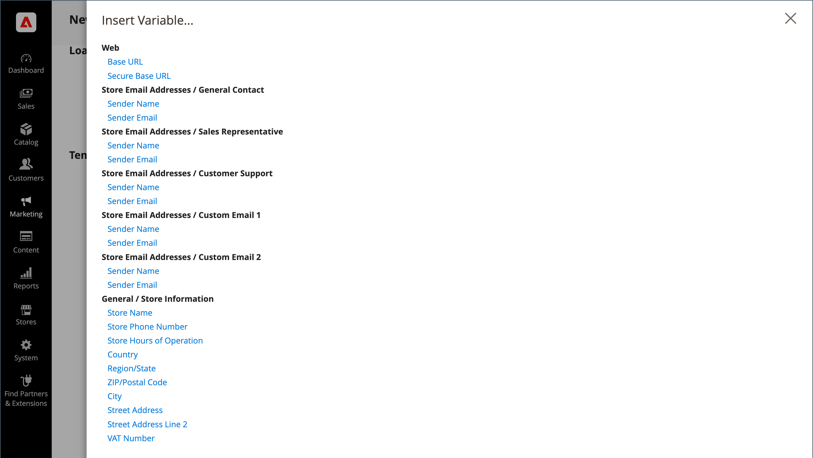
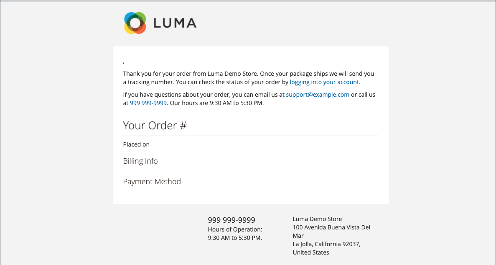

# Utilisation de variables prédéfinies

Les variables [prédéfinies](variables-predefined.md) facilitent la personnalisation des modèles [e-mail](email-templates.md) et [newsletter](../merchandising-promotions/newsletters.md), ainsi que d’autres types de contenu. La liste des variables autorisées [prédéfinies](variables-predefined.md) s’affiche lorsque vous cliquez sur le bouton Insérer une variable . Comme illustré ci-dessous, la liste des variables disponibles pour un modèle d’e-mail spécifique est déterminée par les données associées au modèle. Consultez la [Référence de variable](variables-reference.md) pour obtenir une liste des modèles d’e-mail fréquemment utilisés et des variables associées.

{width="700" zoomable="yes"}

## Ajouter une variable à un modèle d’e-mail

1. Dans la barre latérale _Admin_, accédez à **[!UICONTROL Marketing]** > _[!UICONTROL Communications]_>**[!UICONTROL Email Templates]**.

1. Effectuez l’une des opérations suivantes :

   - Pour ajouter la variable à un modèle existant, cliquez sur le modèle dans la liste pour l’ouvrir en mode d’édition.

   - Pour utiliser la variable dans un nouveau modèle, cliquez sur **[!UICONTROL Add New Template]** et personnalisez le code du modèle par défaut. Voir [Modèles de message](email-template-custom.md#message-templates).

1. Sous _[!UICONTROL Load default template]_, choisissez les **[!UICONTROL Template]**&#x200B;à personnaliser.

1. Pour appliquer un modèle, cliquez sur **[!UICONTROL Load Template]**.

   Le champ _[!UICONTROL Currently used for]_&#x200B;affiche le chemin de configuration du modèle. Les&#x200B;_[!UICONTROL Template Subject]_ et _[!UICONTROL Template Content]_&#x200B;sont automatiquement générés par rapport au modèle sélectionné.

   - **[!UICONTROL Template Subject]** - Ce texte est affiché dans l’objet d’un e-mail.

   - **[!UICONTROL Template Content]** - Ce texte s’affiche dans le contenu complet de l’e-mail envoyé.

   {width="600" zoomable="yes"}

1. Saisissez un **[!UICONTROL Template Name]**.

1. Pour obtenir la liste des variables [prédéfinies](variables-predefined.md) pouvant être utilisées avec ce modèle d’e-mail, cliquez sur **[!UICONTROL Insert Variable]**.

   Déterminez la variable que vous souhaitez insérer dans le modèle. Cliquez ensuite sur _Fermer_ (X) dans le coin supérieur droit. (Vous y reviendrez plus tard.)

1. Pour afficher une maquette du modèle, cliquez sur **[!UICONTROL Preview Template]** dans la barre de boutons.

   Lorsque l’aperçu s’ouvre dans un nouvel onglet, déterminez où vous souhaitez placer la variable par rapport à l’autre contenu. Revenez ensuite à l’onglet d’origine pour continuer.

   {width="600" zoomable="yes"}

1. Dans la zone de **[!UICONTROL Template Content]**, placez le point d&#39;insertion à l&#39;endroit où vous souhaitez que la variable apparaisse, puis cliquez sur **[!UICONTROL Insert Variable...]**.

1. Dans la liste des variables disponibles, cliquez sur celle que vous souhaitez insérer dans le modèle.

1. Cliquez ensuite sur **[!UICONTROL Save Template]**.

## Convertir le modèle en texte brut

1. Ouvrez un modèle en mode d’édition.

1. En haut de la page, cliquez sur **[!UICONTROL Convert to Plain Text]**.

1. Lorsque vous êtes invité à supprimer des balises, cliquez sur **[!UICONTROL OK]**.

1. Pour enregistrer la version en texte brut, cliquez sur **[!UICONTROL Save Template]**.

## Restaurer la version d’HTML

1. En haut de la page, cliquez sur **[!UICONTROL Return HTML Version]**.

1. Pour enregistrer la version HTML du modèle, cliquez sur **[!UICONTROL Save Template]**.
